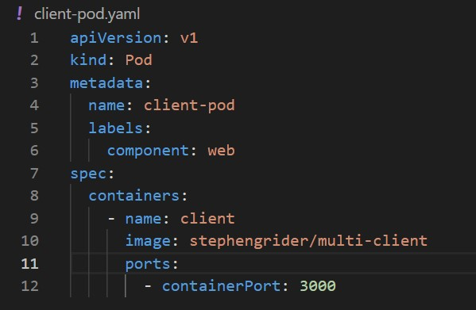
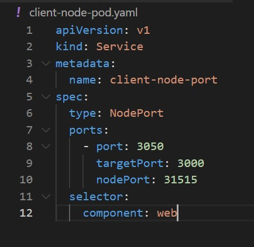
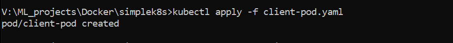
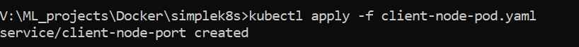
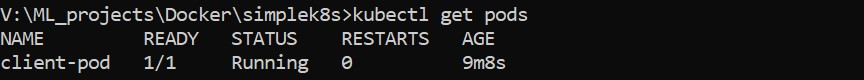
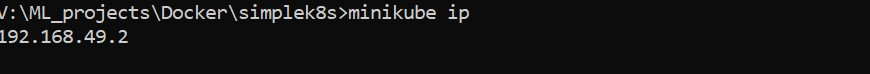
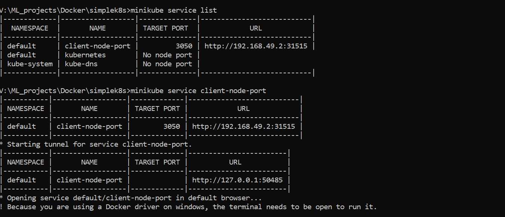
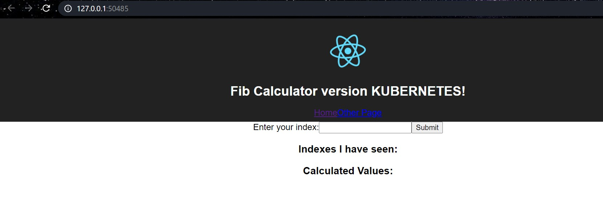

## Client-pod.yaml

## Client-node-pod.yaml

•	Kind: Type of object in k8 in cluster
Subtypes or obj type of service:

1)	ClusterIP
2)	NodePort: Exposes a container to outside world (only good for dev purposes)
3)	LoadBalancer
4)	Ingress

•	Version: Different set of object or scopes of types of objects to specify
•	Selector: Label selector property to link object
              specify to send traffic to client pod
•	Ports: All port to be open & mapped to target 
•	NodePort: URL port range (30000,32767) not always to specify. 

|kubectl	| apply | -f	| filename|
------- | ---------|-----|-----------| 
|CMD    | Change configuration of Cluster| we want to specify a file that has the config changes|

 

 |kubectl	|get 	|pods|
 |-----   |-----|----|
 |      |We want to retrieve information| specifies object type about running object 
 

 
 

Issue 
https://stackoverflow.com/questions/62375642/minikube-ip-returns-127-0-0-1-kubernetes-nodeport-service-not-accessable
