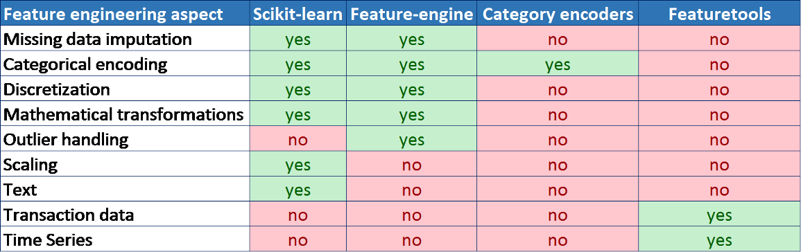
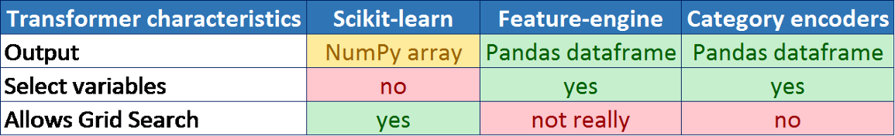
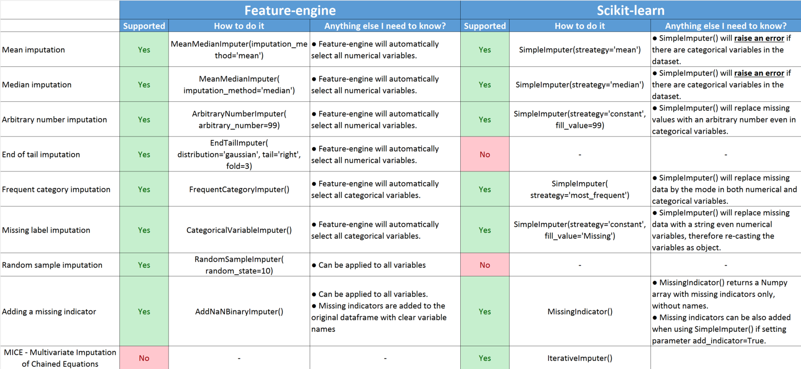
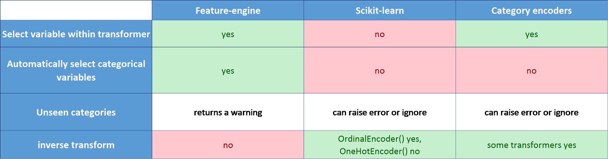
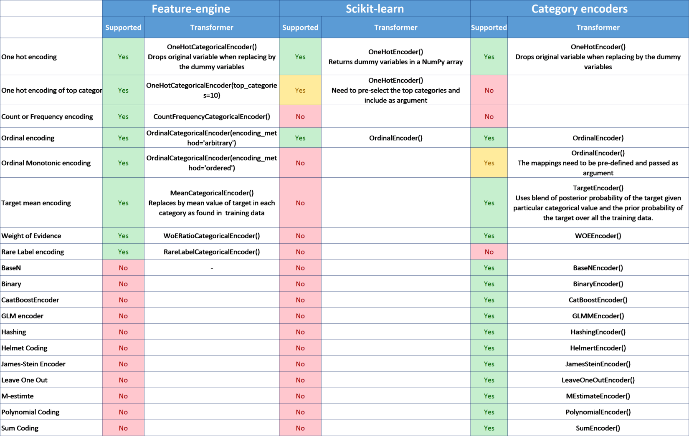
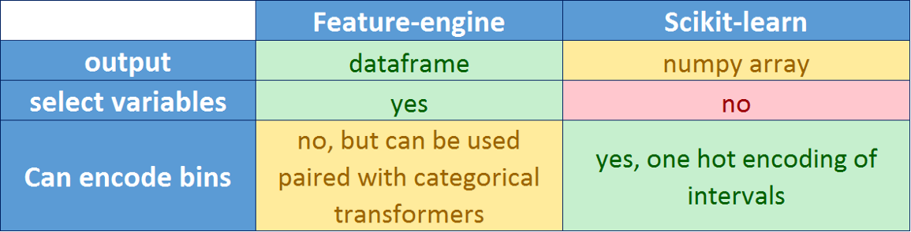
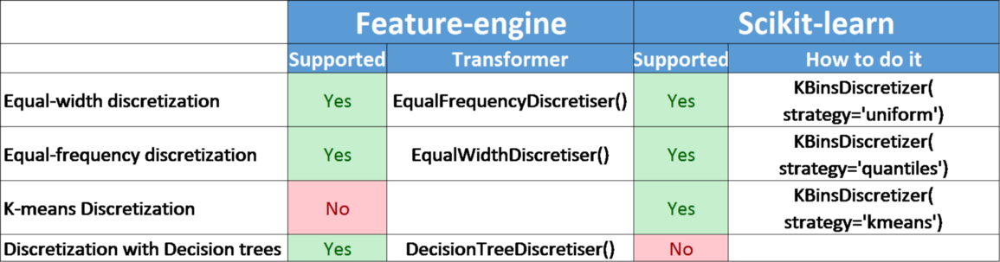

## Feature Engineering libraries with Comparision
##### ref (https://towardsdatascience.com/practical-code-implementations-of-feature-engineering-for-machine-learning-with-python-f13b953d4bcd)
<ul>
  <li>Scikit-learn 
  <li>Feature-engine 
  <li>Category Encoders 
</ul>

### Table 1: Feature engineering methods supported by the different Python libraries

### Table 2 below summarizes these key differences between the three packages.

### Table 3 below summarizes the techniques supported by each package and the main takeaways of their advantages and shortcomings.

### Table 3: Comparison of Imputation techniques supported by each Python library

