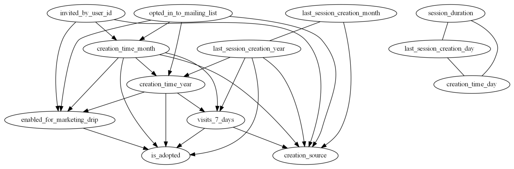
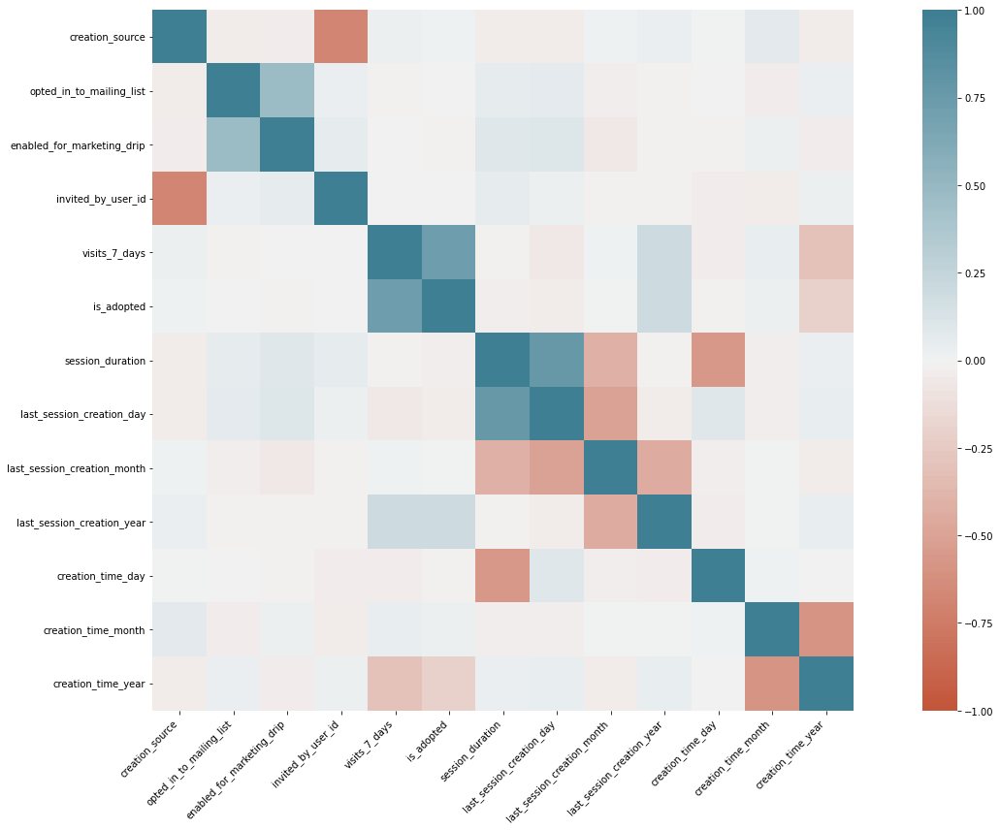
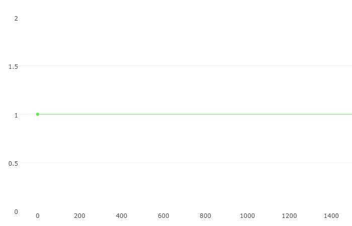

## Use Case
A client has data on users for an application from the past two years. They define an "adopted user" as a user who has logged into the application on three separate days in at least one seven ­day period. They want to understand what variables contribute to a user converting into an adopted user. The assignment is to inspect the data and prepare an analysis that shows non-technical stakeholders what variables and conditions are associated with user adoption.

A user table ("takehome_users") with data on 12,000 users who signed up for the product in the last two years. This table includes:
● name: the user's name
● object_id: the user's id
● email: email address
● creation_source: how their account was created. This takes on one of 5 values:

        ○  PERSONAL_PROJECTS: invited to join another user's personal workspace
        ○  GUEST_INVITE: invited to an organization as a guest (limited permissions)            
        ○  ORG_INVITE: invited to an organization (as a full member)            
        ○  SIGNUP: signed up via the website
        ○  SIGNUP_GOOGLE_AUTH: signed up using Google Authentication (using a Google email account for their login id)                                                                              
● creation_time: when they created their account
● last_session_creation_time: unix timestamp of last login
● opted_in_to_mailing_list: whether they have opted into receiving marketing emails

● enabled_for_marketing_drip: whether they are on the regular marketing email drip
● org_id: the organization (group of users) they belong to
● invited_by_user_id: which user invited them to join (if applicable) A usage summary table ("takehome_user_engagement") that has a row for each day that a user logged into the product. Instructions

Defining an "adopted user" as a user who has logged into the application on three separate days in at least one seven ­day period, identify which factors predict future user adoption. Arriving at an answer may look something like this:

Merge, clean, and organize data as necessary

Define a transformation to evaluate which users are adopted users along with other feature engineering

Conduct exploratory data analysis

If necessary, develop a machine-learning model

Produce a report with findings about the influence of different variables with respect to adopted users. We suggest spending 1­-2 hours on this, but you're welcome to spend more or less. Please send us a brief writeup of your findings (the more concise, the better -­­ no more than one page), along with any summary tables, graphs, code, or queries that can help us understand your approach. Please note any factors you considered or investigations you did, even if they did not pan out. Feel free to identify any further research or data you think would be valuable.

### Applied Methods 
       

#### 1) Causal Inference:
   
    To Find Cause and effect: Here we use pc_algo from causal-learn library to check direct and indirect causes i.e. our       features and outcome as is_adopted          
       
  

  
  
#### Observations
  1) Invited by user_id,opted_in_to_mailing_list and last_session_creation_month are main causes.
  
  2) As above list of causal features not directly cause but affecting indirectly through intermediate date time we splited      like month,year and likewise 
  
  3) Direct cause is Visit_7_days and enabled for marketing_drip 
  
  #### conclusions of causal inference 
  
  1) Direct cause features can be trigger points and more emphasize to convert it for adoption 
  
  
  #### 2) Lets see Correlation matrix
  
   

   #### Observation 
    1) Captures relation of visit_7_days and is_adopted as positive 
    2) opted in mailing list and enable for marketing drip positive
    3) Invited_by user_id and creation source as negative 
    4) Session duration and creation has negative 
    
### Model 
   #### 1) Catboost model 
    
   
   
   ##### Observation 
     1) Model was unable to classify may be some additional data be required or prepared with SMOTE
     