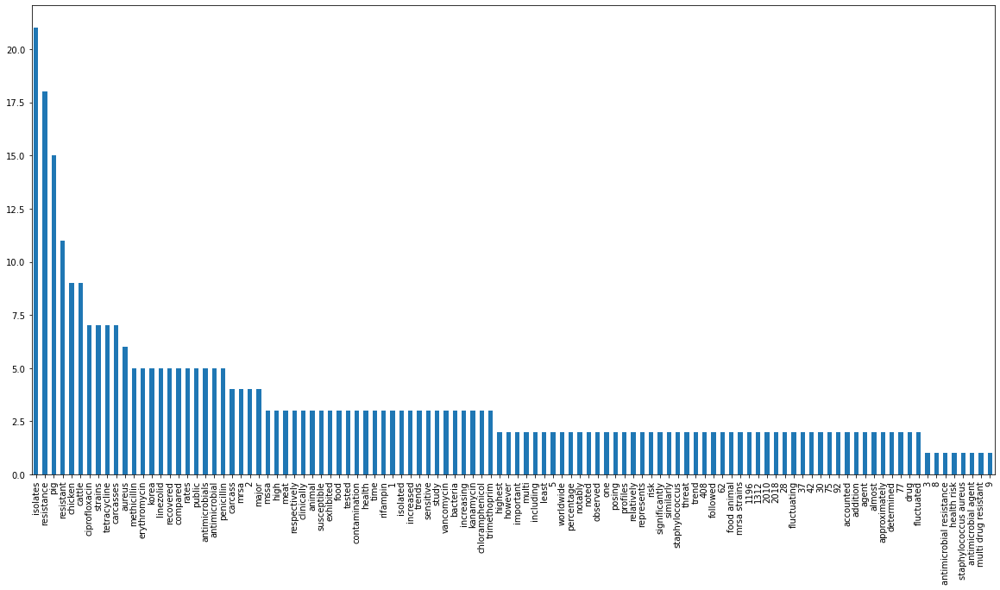

## KeyPhrase Extractor and Normalization

## Design

### Input Data:
Raw Text 

In our case: Abstract+Title in CSV

### Candidate Keyword and Phrase Extractor 
It will be used extract candidate keywords. To Extract candidate keyphrase various Techniques are used mention below.
 1. Phrase Extraction: Scispacy Entity Extraction
 2. Bioword Vocabulary: To maintain MESH Terminology 
 3. TFIDF: To Maintain Co-Occurences
 
#### eg:
### Input data:
contamination of meat with antimicrobial resistant bacteria represents a major public health threat worldwide  in this study   we determined the antimicrobial resistance profiles and resistance trends of staphylococcus aureus isolated from major food animal carcasses  408 cattle   1196 pig   and 1312 chicken carcass isolates  in korea from 2010 to 2018  approximately 75    92    and 77  of cattle   pig   and chicken carcass isolates   respectively   were resistant to at least one antimicrobial agent  resistance to penicillin  62 1   was the highest   followed by resistance to tetracycline  42 1   and erythromycin  28 2    about 30  of pig and chicken isolates were resistant to ciprofloxacin  we observed linezolid resistance only in pig isolates  2 3    however   all s  aureus isolates were sensitive to rifampin and vancomycin  we noted an increasing but fluctuating trend of kanamycin and penicillin resistance in cattle isolates  similarly   the chloramphenicol   ciprofloxacin   tetracycline   and trimethoprim resistance rates were increased but fluctuated through time in pig isolates  methicillin resistant s  aureus  mrsa  accounted for 5    8    and 9  of the cattle   pig   and chicken isolates   respectively  the mrsa strains exhibited significantly high resistance rates to most of the tested antimicrobials   including ciprofloxacin   erythromycin   and tetracycline compared with methicillin susceptible s  aureus  mssa  strains  notably   a relatively high percentage of mrsa strains  5 2   recovered from pig carcasses were resistant to linezolid compared with mssa strains  2 1    in addition   almost 37  of the isolates were multi drug resistant  s  aureus isolates recovered from major food animal carcasses in korea exhibited resistance to clinically important antimicrobials   posing a public health risk 

### Candidate Keywords

candidate Keywords ['contamination', 'meat', 'antimicrobial', 'bacteria', 'public', 'study', 'antimicrobial resistance', 'resistance', 'trends', 'staphylococcus aureus', 'isolated', 'food animal', 'carcasses', 'cattle', 'pig', 'chicken', 'isolates', 'korea', 'cattle', 'pig', 'chicken', 'carcass', 'isolates', 'resistant', 'antimicrobial agent', 'resistance', 'penicillin', 'resistance', 'tetracycline', 'erythromycin', 'pig', 'chicken', 'isolates', 'resistant', 'ciprofloxacin', 'linezolid', 'resistance', 'pig', 'isolates', 'isolates', 'sensitive', 'rifampin', 'vancomycin', 'increasing', 'kanamycin', 'penicillin', 'resistance', 'cattle', 'isolates', 'chloramphenicol', 'ciprofloxacin', 'tetracycline', 'trimethoprim', 'resistance', 'rates', 'increased', 'time', 'pig', 'isolates', 'methicillin', 'resistant', 'cattle', 'pig', 'chicken', 'isolates', 'mrsa strains', 'resistance', 'rates', 'tested', 'antimicrobials', 'ciprofloxacin', 'erythromycin', 'tetracycline', 'compared', 'methicillin', 'susceptible', 'strains', 'mrsa strains', 'recovered', 'pig', 'carcasses', 'resistant', 'linezolid', 'compared', 'strains', 'isolates', 'multi drug resistant', 'isolates', 'recovered', 'food animal', 'carcasses', 'korea', 'resistance', 'clinically', 'antimicrobials', 'public', 'health risk', '1196', '1312', '2010', '2018', '28', '30', '37', '408', '42', '62', '75', '77', '92', 'accounted', 'addition', 'agent', 'almost', 'animal', 'antimicrobial', 'antimicrobials', 'approximately', 'aureus', 'bacteria', 'carcass', 'carcasses', 'cattle', 'chicken', 'chloramphenicol', 'ciprofloxacin', 'clinically', 'compared', 'contamination', 'determined', 'drug', 'erythromycin', 'exhibited', 'fluctuated', 'fluctuating', 'followed', 'food', 'health', 'high', 'highest', 'however', 'important', 'including', 'increased', 'increasing', 'isolated', 'isolates', 'kanamycin', 'korea', 'least', 'linezolid', 'major', 'meat', 'methicillin', 'mrsa', 'mssa', 'multi', 'notably', 'noted', 'observed', 'one', 'penicillin', 'percentage', 'pig', 'posing', 'profiles', 'public', 'rates', 'recovered', 'relatively', 'represents', 'resistance', 'resistant', 'respectively', 'rifampin', 'risk', 'sensitive', 'significantly', 'similarly', 'staphylococcus', 'strains', 'study', 'susceptible', 'tested', 'tetracycline', 'threat', 'time', 'trend', 'trends', 'trimethoprim', 'vancomycin', 'worldwide', 'contamination', 'meat', 'antimicrobial', 'resistant', 'bacteria', 'represents', 'major', 'public', 'health', 'threat', 'worldwide', 'study', 'determined', 'antimicrobial', 'resistance', 'profiles', 'resistance', 'trends', 'staphylococcus', 'aureus', 'isolated', 'major', 'food', 'animal', 'carcasses', '408', 'cattle', '1196', 'pig', '1312', 'chicken', 'carcass', 'isolates', 'korea', '2010', '2018', 'approximately', '75', '92', '77', 'cattle', 'pig', 'chicken', 'carcass', 'isolates', 'respectively', 'resistant', 'least', 'one', 'antimicrobial', 'agent', 'resistance', 'penicillin', '62', '1', 'highest', 'followed', 'resistance', 'tetracycline', '42', '1', 'erythromycin', '28', '2', '30', 'pig', 'chicken', 'isolates', 'resistant', 'ciprofloxacin', 'observed', 'linezolid', 'resistance', 'pig', 'isolates', '2', '3', 'however', 'aureus', 'isolates', 'sensitive', 'rifampin', 'vancomycin', 'noted', 'increasing', 'fluctuating', 'trend', 'kanamycin', 'penicillin', 'resistance', 'cattle', 'isolates', 'similarly', 'chloramphenicol', 'ciprofloxacin', 'tetracycline', 'trimethoprim', 'resistance', 'rates', 'increased', 'fluctuated', 'time', 'pig', 'isolates', 'methicillin', 'resistant', 'aureus', 'mrsa', 'accounted', '5', '8', '9', 'cattle', 'pig', 'chicken', 'isolates', 'respectively', 'mrsa', 'strains', 'exhibited', 'significantly', 'high', 'resistance', 'rates', 'tested', 'antimicrobials', 'including', 'ciprofloxacin', 'erythromycin', 'tetracycline', 'compared', 'methicillin', 'susceptible', 'aureus', 'mssa', 'strains', 'notably', 'relatively', 'high', 'percentage', 'mrsa', 'strains', '5', '2', 'recovered', 'pig', 'carcasses', 'resistant', 'linezolid', 'compared', 'mssa', 'strains', '2', '1', 'addition', 'almost', '37', 'isolates', 'multi', 'drug', 'resistant', 'aureus', 'isolates', 'recovered', 'major', 'food', 'animal', 'carcasses', 'korea', 'exhibited', 'resistance', 'clinically', 'important', 'antimicrobials', 'posing', 'public', 'health', 'risk']

### plot of frequency of element

## Maximal Marginal Retrieval(MMR):

1. To Remove redundancy we use MMR, It uses sentence embedding and candidate words embedding.
2. It takes as various parameters 
   1. <b>Diversity</b>: It controls diversity across normalized keyphrases 
   2. <b>No of terms</b>: It controls length of Normalized keywords to be Extracted 

Here we have used Pretrained model and Trained our data with various models 
 1. <b>DistilBert-uncased: Fastest BERT</b> 
 2. <b>Scibert sentence embedding: gsarti/scibert-nli</b>

### Normalized Keywords:

['chicken', 'cattle', 'kanamycin', 'ciprofloxacin', 'worldwide', 'erythromycin', 'pig', 'rifampin', 'bacteria', 'meat', 'chloramphenicol', 'penicillin', 'vancomycin']

