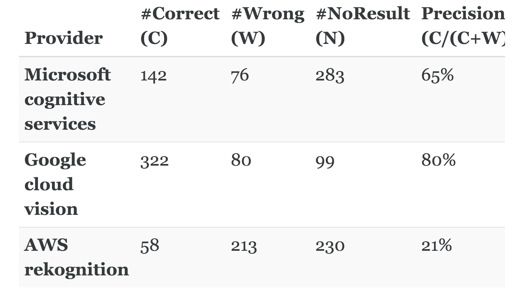

# Optical Character Recognition (OCR)
## Lets Explore Cloud 


Ref:
```
https://nanonets.com/blog/invoice-ocr/
```


### Various DOcuments
```
http://www.cs.cmu.edu/~aharley/rvl-cdip/
```

# PDF Extraction using Tesseract

- ## About
An OCR project as a Proof of Concept to deploy a machine learning project using Streamlit. The text extraction process is accompanied with image processing for better text recognition and achieving higher efficiency. 

- ## Libraries / Frameworks
    1. Streamlit - UI
    2. Tkinter - File download setup
    3. Pytesseract
    4. Pdf2Image
    5. OpenCV - Image Processing
    6. Tabula
   
- ## Code Execution
    1. Make sure you have Python 3.8 installed on the system.
    2. Open cmd where the contents are unzipped.
    3. Run the below command to install required packages.
        > pip install -r requirements.txt
    4. Install [Tesseract setup file](https://tesseract-ocr.github.io/tessdoc/Downloads.html)
    5. Once all packages are installed, run the following command:
        > streamlit run OCR.py

If facing any issues, [contact me](mailto:mahimkaradi@gmail.com)

- ## Output

Bounding Box around recognized text


Text extraction and document saved


Extracted Text Output


## Large pdf file text extraction
1.  user pdf import 
2.  Pdf exceeding 50 pages
3.  enter the segment of pages to extract [(1, 1), {'start': 3, 'end': 5}]
4   run bounding box show the pages whether it is relevant 
5.  if yes extract text from pages
6.  else select another segment of pages

##  Exploration and observation 
1_ Time consumption;
2_ Process optimization;(parsing and Text)
3_ Functional optimization


## issue and further dev
```
 def displayPDF(file):
     # Opening file from file path
     with open(file, "rb") as f:
         base64_pdf = base64.b64encode(f.read()).decode('utf-8')
 
     # Embedding PDF in HTML
     pdf_display = F'<embed src="data:application/pdf;base64,{base64_pdf}" width="700" height="1000" type="application/pdf">'
 
     return pdf_display
```

```
    pyLDAvis.enable_notebook()
    pyLDAvis.display(vis)
```

### Multi pages Streamlit 

```
https://blog.streamlit.io/introducing-multipage-apps/
```

### Usecase 
1. Topic Modeling 
 


2. Invoice Data Extraction

## CNN is always a Solution

### Invoice Data Extraction
Steps mention [here](https://medium.com/analytics-vidhya/invoice-information-extraction-using-ocr-and-deep-learning-b79464f54d69)
1. Detection Modelling:
    1. FRCNN and SSD
    2. Labeling : 
       1. Open Data Source
       The RVL-CDIP (Ryerson Vision Lab Complex Document Information Processing) dataset consists of 400,000 grayscale images in 16 classes, with 25,000 images per class. There are 320,000 training images, 40,000 validation images, and 40,000 test images. The images are sized so their largest dimension does not exceed 1000 pixels. 
       [The RVL-CDIP Dataset](http://www.cs.cmu.edu/~aharley/rvl-cdip/)
        
2. Texts Extraction:
    1. Pytesseract:
           
3. Text Categorization
   1. Spacy NER

Ref 

```
https://vigneshgig.medium.com/how-to-extract-the-structure-of-invoice-data-using-tensorflow-api-faster-crnn-object-detection-8aa15c12bb46
```

# 3 Text AnalyZer

1. NER with Classes 
   1. Extract text from pdf is input 
   2. Identify languages 
   3. First we go for Spacy NER models 
   4. BERT variations 

Fewshot and finetuning model
https://towardsdatascience.com/zero-and-few-shot-learning-c08e145dc4ed

https://medium.com/@andrewmarmon/fine-tuned-named-entity-recognition-with-hugging-face-bert-d51d4cb3d7b5

https://www.freecodecamp.org/news/getting-started-with-ner-models-using-huggingface/  


2.Word Similarity 
3 Ngrams frequencies  
4. Trending Keywords periodically


## Advanced PDF Extraction

### OCR and OPenCV
#### Invoice Data  
[Extracting Information FromPDF Invoices Using Deep Learning](https://www.diva-portal.org/smash/get/diva2:1608779/FULLTEXT01.pdf)
[how-to-extract-structured-data-from-invoices](https://medium.com/nanonets/how-to-extract-structured-data-from-invoices-f7de539eb475)
[data-extraction-from-unstructured-pdfs](https://www.analyticsvidhya.com/blog/2021/06/data-extraction-from-unstructured-pdfs/)
[How to Train a Joint Entities and Relation Extraction Classifier using BERT Transformer with spaCy 3](https://towardsdatascience.com/how-to-train-a-joint-entities-and-relation-extraction-classifier-using-bert-transformer-with-spacy-49eb08d91b5c)

#### Tabel Data
[table-extraction-using-deep-learning](https://medium.com/analytics-vidhya/table-extraction-using-deep-learning-3c91790aa200)
[Extracting-Tabular-Data-from-PDFs-using-Object-Detection-with-Keras-Retinanet](https://github.com/ektaatomar/Extracting-Tabular-Data-from-PDFs-using-Object-Detection-with-Keras-Retinanet)


#### Dataset 
Our dataset includes four different layout invoices from different supplier organizations. The number of scanned invoice PDFs for layout 1 is 196, layout 2 is 29, layout 3 is 14, and layout four is 391. Thus, our dataset has 630 total scanned invoice PDFs.
[here](https://www.mdpi.com/2306-5729/6/7/78/htm)

#### Cloud 

#### GCP
https://ai.googleblog.com/2020/06/extracting-structured-data-from.html
[DocumentAI](https://cloud.google.com/document-ai)

https://blog.google/products/search/introducing-mum/
[T5](https://ai.googleblog.com/2020/02/exploring-transfer-learning-with-t5.html
)

https://stackoverflow.com/questions/47533875/how-to-extract-table-as-text-from-the-pdf-using-python

#### AWS
https://sagemaker-examples.readthedocs.io/en/latest/

RE match 
https://stackoverflow.com/questions/64142307/how-to-extract-only-specific-text-from-pdf-file-using-python
https://stackoverflow.com/questions/67762088/how-do-i-remove-nan-values-while-reading-a-pdf-using-tabula-in-python
https://stackoverflow.com/questions/58077261/extract-table-from-pdf-with-coordinates


Pages

1) Platform 
2) OCR engine support: Data format(invoice , Information Memorandium, Annual Report, topic report)
3) Topic Modelling
4) Statistical Inferences(NER) 


entity_dict = 
{
"Issuer": issuer, 'Type_of_instrument':Type_of_instrument, "Seniority": Seniority,
"Security":Security,"Date of Maturity":Date_of_Maturity, 
"Deemed Date of Allotment":Deemed_Date_of_Allotment,
"Coupon":coupon,
"Coupon Payment Frequency":Coupon_Payment_Frequency
}


Algorithm flow

```

def paragraph parser(text)
    pass
    return paragraph_list


def pdf_page_box(image,show_boxex=1):
    img = cv2.imread(curr_img)
    gray = cv2.cvtColor(img, cv2.COLOR_BGR2GRAY)
    blur = cv2.GaussianBlur(gray, ksize=(9, 9), sigmaX=0)
    # _, thresh = cv2.threshold(blur, 127, 255, cv2.THRESH_BINARY)
    thresh = cv2.adaptiveThreshold(blur, 255, cv2.ADAPTIVE_THRESH_GAUSSIAN_C, cv2.THRESH_BINARY_INV, 11, 30)
    kernel = cv2.getStructuringElement(cv2.MORPH_RECT, (9, 9))
    dilate = cv2.dilate(thresh, kernel, iterations=4)
    contours, _ = cv2.findContours(dilate, mode=cv2.RETR_EXTERNAL, method=cv2.CHAIN_APPROX_SIMPLE)

    temp = []
    for contour in contours:
        x, y, w, h = cv2.boundingRect(contour)
        # print(x, y, w, h)
        if cv2.contourArea(contour) < 10000:
            continue
        temp.append([x, y, w, h])
        if show_boxes:
            cv2.rectangle(img, (x, y), (x + w, y + h), color=(255, 0, 255), thickness=3)
    if show_boxes:
        img = cv2.resize(img, (500, 700), interpolation=cv2.INTER_AREA)
        st.image(image=img, caption=curr_img)
        # cv2.imshow(curr_img, img)
        # cv2.waitKey(0)
    boxes[curr_img] = temp
    return boxes

# text is extracted from each contours stored
def extract_text(boxes):
    pytesseract.pytesseract.tesseract_cmd = r'C:/Program Files/Tesseract-OCR/tesseract.exe'
    tessdata_dir_config = "--tessdata-dir 'C:/Program Files/Tesseract-OCR/tessdata'"

    text = ''
    for key in boxes:
        img = cv2.imread(key)
        for x, y, w, h in boxes[key]:
            cropped_image = img[y:y + h, x:x + w]
            _, thresh = cv2.threshold(cropped_image, 127, 255, cv2.THRESH_BINARY)
            text += str(pytesseract.image_to_string(thresh, config=tessdata_dir_config))
    print('Text Extraction Completed!')
    return text


#entity_dict['page_no']=
#iterate page  

path=''
pages=convert_from_path(path,dpi=300)
page_no=1
for page in pages:
    entity_dict['page_no']=page_no
    
    img_str='page' + str(page_no) + '.jpg'
    boxes=pdf_page_box(img_str,show_boxes=1)

    text=extract_text(boxes)
    print(text)        
    
```