# Product Extraction and Product Consolidation
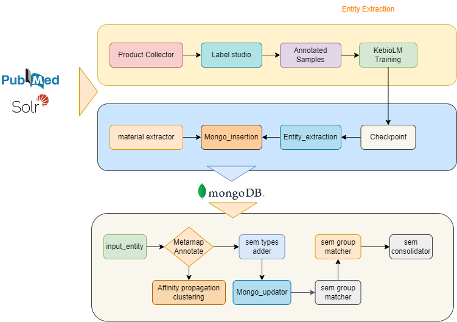


# Product Extraction
1. First testing previous models
2. Define new model with detail workflow 

## Model Testing 
We will be testing previous model with details mentioned below

#### server:
```
uc1f-bioinfocloud-assembly-base.sial.com
```

### Activation of Product Environment for previous model checks

```
cd /data2/skumar20/Product_prediction
conda activate product_env
```

## Scibert Model
1. 1.14M papers from Semantic  Scholar (Ammar et al., 2018). 
2. This corpus consists of 18% papers from the computer science domain and 82% from the broad biomedical domain
3. The average paper length is 154 sentences (2,769 tokens) resulting in a corpus size of 3.17B tokens, 
   similar to the 3.3B tokens  on which BERT was trained.

4. 4 models 
   (i)   cased or uncased  
   (ii)  BASEVOCAB or SCIVOCAB.
   (iii) The two models that use BASEVOCAB are finetuned from the corresponding BERT-Base models. The
         other two models that use the new SCIVOCAB are trained from scratch

5. Finetuning 
   1. Text classification: [CLS] --> Linear classification layer
   2. NER: token --> Linear classification layer --> softmax output --> conditional random field 
   3. DEP: Dependency tag - arc embedding(size 100) - biaffine matrix --> Bert vectorizer 
   4. Dropout : 0.1 
   5. Loss and Optimizer: Cross Entropy and Adam
   6. Epoch, Batch and learning rate: 2-5, 32 and 5e-6, 1e-5, 2e-5,5e-5
   7. Final set : 2-4 epochs, 2e-5 learning rate 
   
### Command for training if model_name_finetune directory is empty  

```
python run_ner.py --model_name_or_path /data2/skumar20/Product_prediction/pretrained/scibert_scivocab_uncased_hugging_face/ --output_dir ./scibert_fine_tune/ --do_train --do_eval --data_dir ./ --model_type bert --labels labels.txt
```

### command for training and overwrite if model has already been trained and has checkpoint 

```
python run_ner.py --model_name_or_path /data2/skumar20/Product_prediction/pretrained/scibert_scivocab_uncased_hugging_face/ --output_dir ./scibert_fine_tune/ --do_train --do_eval --data_dir ./ --model_type bert --labels labels.txt --overwrite_output_dir
```

### Model Accuracy

#### Previous Data 2k samples
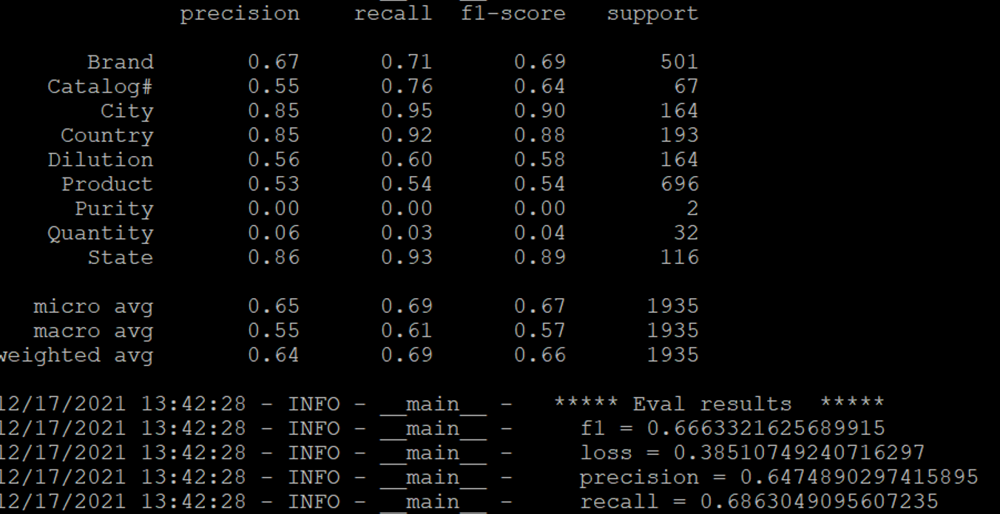

#### Newly updated Data available from Label studio and executing text utility for split into train, test and dev
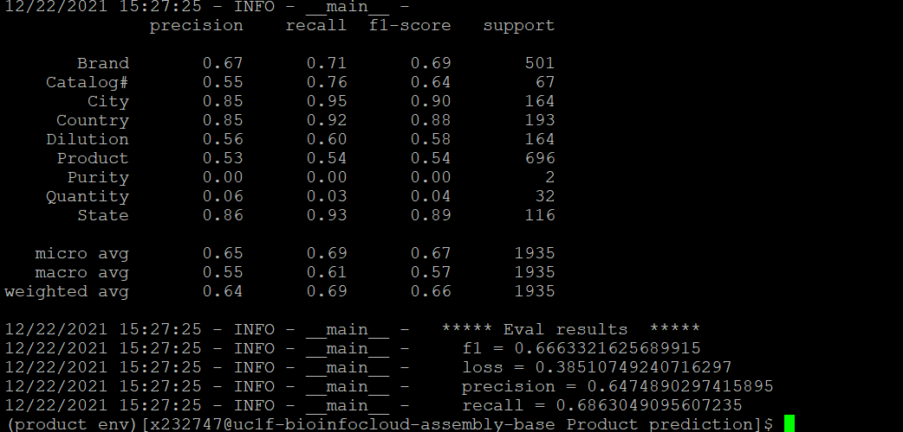

Ref:
https://towardsdatascience.com/how-to-apply-bert-in-scientific-domain-2d9db0480bd9

Steps with keypoints 

1. Data preparation
   i)   Random seed
   ii)  Random Sampler and Data Loader
   iii) Optimizer and schedular --> linear warmup and decay
   
2. Training 


## BioM-Transformers: Building Large Biomedical Language Models with BERT, ALBERT and ELECTRA.

### Ref
https://github.com/salrowili/BioM-Transformers \
https://github.com/google-research/electra\
https://huggingface.co/sultan/BioM-ELECTRA-Large-Discriminator/tree/main \
https://huggingface.co/sultan/BioM-ELECTRA-Large-Discriminator \
https://www.topbots.com/pretrain-transformers-models-in-pytorch 

#### Model config
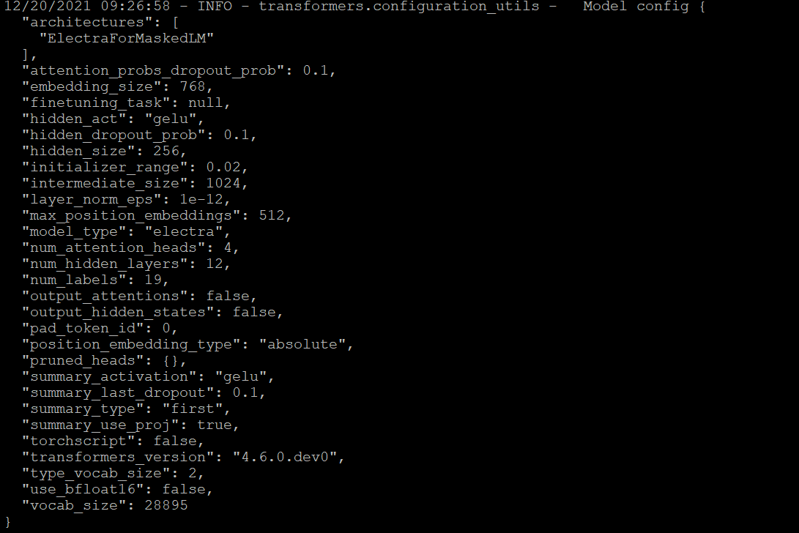

#### Model Accuracy
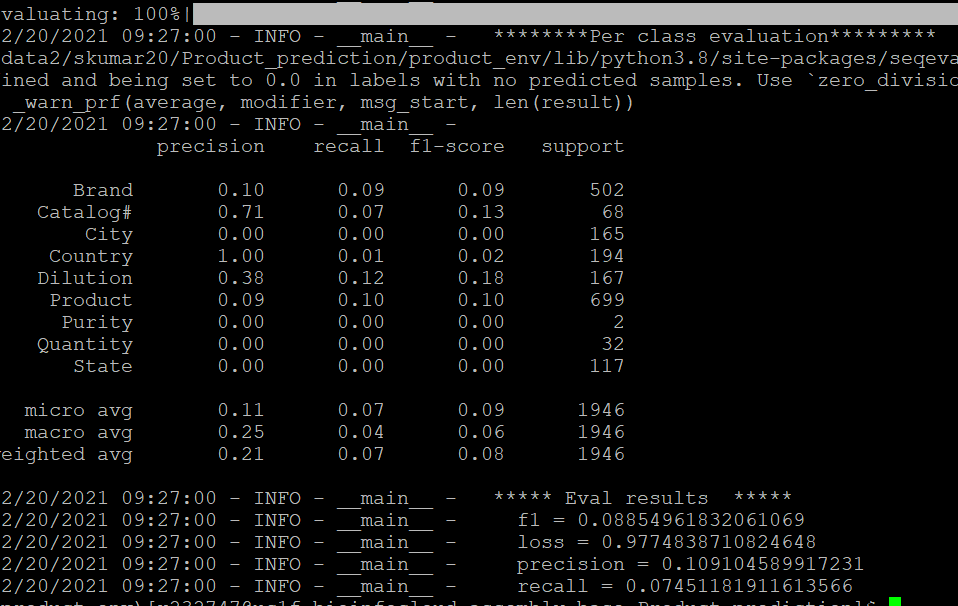****


### BioM-ELECTRA-Base-Generator
## Running Commands
```
Directory
BioM-ELECTRA-Base-Generator_finetune
python run_ner.py --model_name_or_path /data2/skumar20/Product_prediction/pretrained/BioM-ELECTRA-Base-Generator/ --output_dir ./BioM-ELECTRA-Base-Generator_finetune/ --do_train --do_eval --data_dir ./ --model_type bert --labels labels.txt --overwrite_output_dir
```
### BioM-ELECTRA-Base-Discriminator
### Running Commands

```
Directory: BioM-ELECTRA-Large-Discriminator_fine_tune
python run_ner.py --model_name_or_path /data2/skumar20/Product_prediction/pretrained/BioM-ELECTRA-Large-Discriminator/ --output_dir ./BioM-ELECTRA-Large-Discriminator_fine_tune/ --do_train --do_eval --data_dir ./ --model_type bert --labels labels.txt --overwrite_output_dir
```

#### Model Accuracy
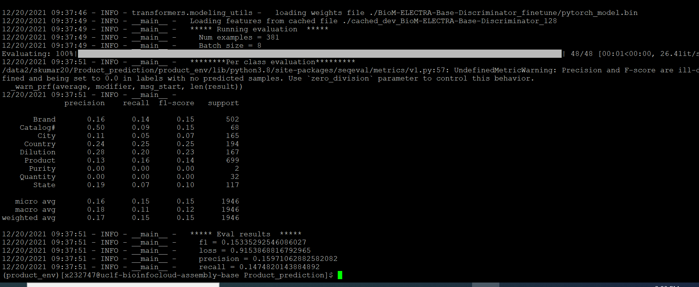

## BioM-ELECTRA-Base-Discriminator

### Running Commands
BioM-ELECTRA-Base-Discriminator_fine_tune
python run_ner.py --model_name_or_path /data2/skumar20/Product_prediction/pretrained/BioM-ELECTRA-Base-Discriminator/ --output_dir ./BioM-ELECTRA-Base-Discriminator_finetune/ --do_train --do_eval --data_dir ./ --model_type bert --labels labels.txt --overwrite_output_dir

### previous method in product_extraction shashi code
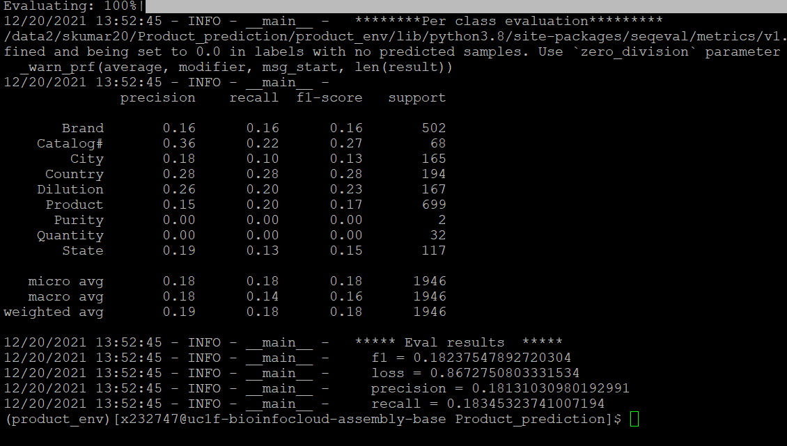


## KeBioLM: Knowledge enhanced Biomedical pretrained Language Model

server uc1f-bioinfocloud-assembly-base.sial.com
path of model: /data2/skumar20/Vikas/product_prediction_v2/KeBioLM

### Paper 
https://arxiv.org/pdf/2104.10344.pdf****

### Repo cloned and configured
https://github.com/GanjinZero/KeBioLM

### Download the pretrain weights
https://drive.google.com/file/d/1kMbTsc9rPpBc-6ezEHjMbQLljW3SUWG9/edit
from google_drive_downloader import GoogleDriveDownloader as gdd
gdd.download_file_from_google_drive(file_id='1kMbTsc9rPpBc-6ezEHjMbQLljW3SUWG9',dest_path='/data2/skumar20/Product_prediction/pretrained/KeBioLM.zip',unzip=True)

### Label data  

### Label Data observation and preprocessing 
1st iteration -> 296 samples(40 pmid)

2nd iteration --> 984 samples

preprocessing for labeled data with second iteration
```
print(replace('\n\n'.join(line.strip('\n') for line in f)).replace('\n\n\n\n','\n-DOCSTART- -X- -X- O\n').replace('\n\n','\n'))
```

### Requirements and Training with Annotated data


```
pip install transformer==3.4.0 
pip install conllu
pip install seqeval
```

## Training model 
```
conda activate /data2/skumar20/Vikas/product_prediction_v2/prod_env
# if already its finetune and checkpoint  
rm -rf finetune
cd /data2/skumar20/Vikas/product_prediction_v2/KeBioLM/ner/

# training with data_directory containing Annotated data and labels containing text
CUDA_VISIBLE_DEVICES=0 python run_ner.py --data_dir ../data_dir --model_name_or_path ../KeBioLM_model/ --output_dir ../finetune/checkpoint-1000 --num_train_epochs 10 --do_train --do_eval --do_predict --overwrite_output_dir --gradient_accumulation_steps 2 --learning_rate 3e-5 --warmup_steps 1710 --evaluation_strategy steps --max_seq_length 512 --per_device_train_batch_size 8 --eval_accumulation_steps 1 --load_best_model_at_end --metric_for_best_model f1 --labels labels.txt

# Below are the hyperparameters are used for testing 
# gradient_accumulation_steps
CUDA_VISIBLE_DEVICES=0 python run_ner.py --data_dir ../data_dir --model_name_or_path ../KeBioLM_model/ --output_dir ../finetune --num_train_epochs 10 --do_train --do_eval --do_predict --overwrite_output_dir --gradient_accumulation_steps 4 --learning_rate 3e-5 --warmup_steps 1710 --evaluation_strategy steps --max_seq_length 512 --per_device_train_batch_size 8 --eval_accumulation_steps 1 --load_best_model_at_end --metric_for_best_model f1 --labels labels.txt 

# gradient_accumulation_steps and 20 epoch
CUDA_VISIBLE_DEVICES=0 python run_ner.py --data_dir ../data_dir --model_name_or_path ../KeBioLM_model/ --output_dir ../finetune --num_train_epochs 20 --do_train --do_eval --do_predict --overwrite_output_dir --gradient_accumulation_steps 2 --learning_rate 3e-5 --warmup_steps 1710 --evaluation_strategy steps --max_seq_length 512 --per_device_train_batch_size 8 --eval_accumulation_steps 1 --load_best_model_at_end --metric_for_best_model f1 --labels labels.txt

# Learning rate 
CUDA_VISIBLE_DEVICES=0 python run_ner.py --data_dir ../data_dir --model_name_or_path ../KeBioLM_model/ --output_dir ../finetune --num_train_epochs 20 --do_train --do_eval --do_predict --overwrite_output_dir --gradient_accumulation_steps 2 --learning_rate 1e-5 --warmup_steps 1710 --evaluation_strategy steps --max_seq_length 512 --per_device_train_batch_size 8 --eval_accumulation_steps 1 --load_best_model_at_end --metric_for_best_model f1 --labels labels.txt
```

## Testing the model prediction

###  Extraction and prediction with real time data

#### Discussed Flow diagram
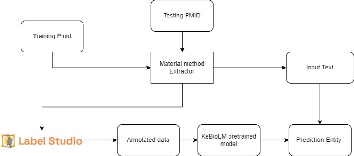

#### Keypoints
1. material methods will be used to extract material method chunks for training data 
2. Then we will use material methods chunks to label studio
3. We will train the KeBiolm model and sample material method chunk will be feed for predictions

#### Implemented Workflow
We will test model accuracy for sample pmid and will predict the entity for material methods data.

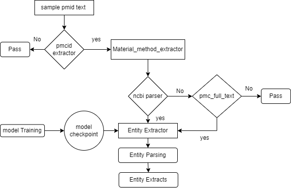


1. create sample pmid in text file
```
/data2/skumar20/Vikas/product_prediction_v2/KeBioLM/predictions/extraction_sample_input_data
```
2. check pmcid present and then extracts Material method extractor function using ncbi and full text extracts
3. Material method chunk will be input for entity extractor
4. Entity parsing will be used to parse and preprocess output data

#### Environment setting and Running Product extraction utility 

```
conda activate /data2/skumar20/Vikas/product_prediction_v2/prod_env
cd /data2/skumar20/Vikas/product_prediction_v2/KeBioLM/predictions/
python product_extractor.py
```

#### Sample data test workflow
```
# sample pmid text files 
cd /data2/skumar20/Vikas/product_prediction_v2/KeBioLM/predictions/extraction_sample_input_data
```
#### Replace required file path for extraction

```
# path 
/data2/skumar20/Vikas/product_prediction_v2/KeBioLM/predictions/

# file
entity_extractor.py
```

#### Product collector
We have created product collector streamlit app to get the data and train the sample data


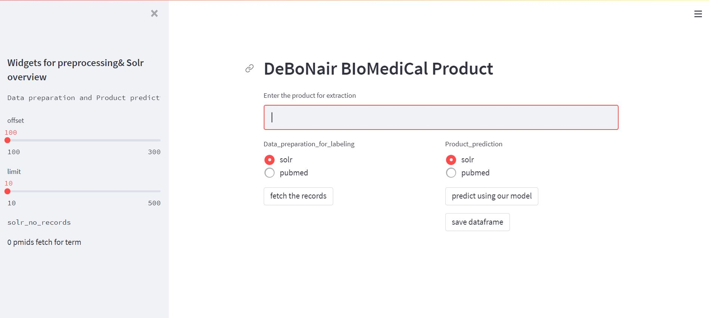

#### Keypoints
1. Terms can be used to search  
2. Pubmed and solr checkbox to search in pubmed or solr
3. Get the material methods or chunks using product extraction v1 for labeling
4. Predict with material methods chunks and saved

#### Mongo_insertion

### Mongo Collection
```
product_prediction_dataset
```
1) Iterate pmid from solr with offset and predict the entity and store in MongoDB  
2) Increase the offset and repeat the step1

Note: To keep track will store the json of updated count 


```
conda activate /data2/skumar20/Vikas/product_prediction_v2/prod_env
cd /data2/skumar20/Vikas/product_prediction_v2/KeBioLM/prod_collector
nohup python mongo_insertion.py

# path of json
/data2/skumar20/Vikas/product_prediction_v2/KeBioLM/prod_collector/prod_data

# eg of json
{"set_parsing_offset": 112650, "solr_parsed_count": 1, "length_pmid_list": 872850, "length_pmcid_list": 241556, "solr_records_remain": 12054549}
```

### Running commands on local follow the steps repo cloning and download pretrain model

```
# conda activate KeBioLM
cd C:\Users\X232747\PycharmProjects\product_extraction\pretrained_model\KebioLM\predictions
```

## Running the Solr and pubmed term extraction matcher for Development
### Pubmed extraction
https://marcobonzanini.com/2015/01/12/searching-pubmed-with-python/

### Search ncbi
https://pubmed.ncbi.nlm.nih.gov/
```
cd C:\Users\X232747\PycharmProjects\product_extraction\pretrained_model\KebioLM\prod_collector
```


### Model Accuracy with previous data 
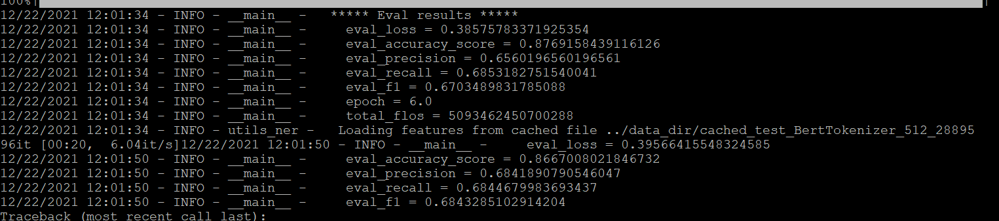

#### with update in --gradient_accumalation_steps from 2 to 4
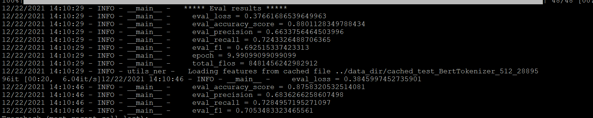

#### Model Accuracy with updated data and --gradient_accumalation_steps 4
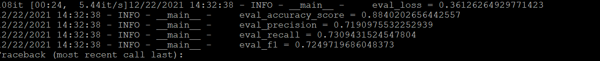


### Statistical Inferences 

### Issues
#### server issues 
1. No space 
https://stackoverflow.com/questions/9510474/removing-pips-cache
pip cache purge\

2. ValueError: Some specified arguments are not used by the HfArgumentParser: ['.txt'] \
ModuleNotFoundError: No module named 'conllu' \
ModuleNotFoundError: No module named 'seqeval' 

Predictions
3. KeyError: 'Indexing with integers (to access backend Encoding for a given batch index) is not available when using Python based tokenizers'
4. RuntimeError: CUDA out of memory. Tried to allocate 12.00 MiB (GPU 0; 15.90 GiB total capacity; 8.12 GiB already allocated; 26.56 MiB free; 8.17 GiB reserved in total by PyTorch) If reserved memory is >> allocated memory try setting max_split_size_mb to avoid fragmentation.  See documentation for Memory Management and PYTORCH_CUDA_ALLOC_CONF

To see user allocation on gpu 
pip3 install nvidia-htop
command : watch nvidia-htop.py

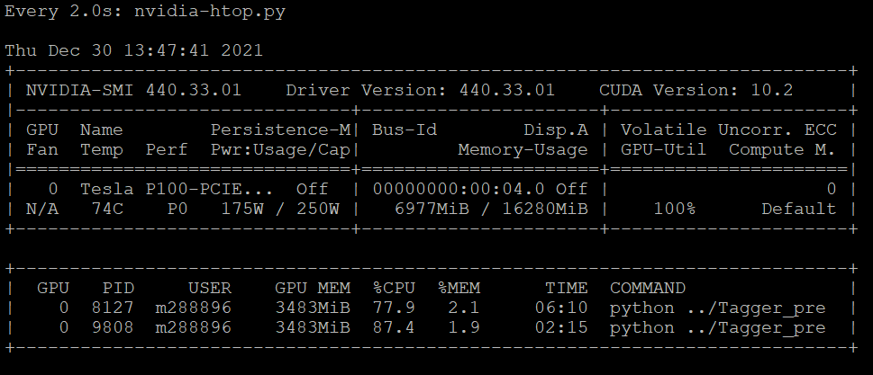

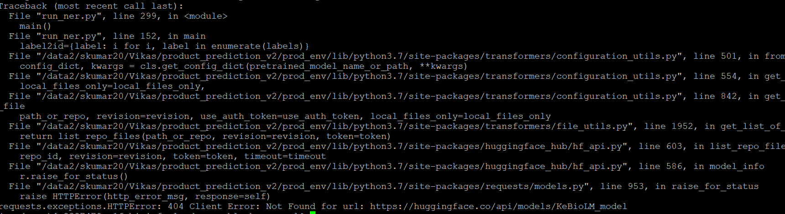

5. Trying Newer version of Transformers without 3.4.0 

6. TypeError: __init__() missing 2 required positional arguments: 'vocab_size' and 'num_entities'
7. ValueError: Unrecognized model in /. Should have a `model_type` key in its config.json, or contain one of the following strings in its name: imagegpt, qdqbert, vision-encoder-decoder, trocr, fnet, segformer, vision-text-dual-encoder, perceiver, gptj, layoutlmv2, beit, rembert, visual_bert, canine, roformer, clip, bigbird_pegasus, deit, luke, detr, gpt_neo, big_bird, speech_to_text_2, speech_to_text, vit, wav2vec2, m2m_100, convbert, led, blenderbot-small, retribert, ibert, mt5, t5, mobilebert, distilbert, albert, bert-generation, camembert, xlm-roberta, pegasus, marian, mbart, megatron-bert, mpnet, bart, blenderbot, reformer, longformer, roberta, deberta-v2, deberta, flaubert, fsmt, squeezebert, hubert, bert, openai-gpt, gpt2, transfo-xl, xlnet, xlm-prophetnet, prophetnet, xlm, ctrl, electra, speech-encoder-decoder, encoder-decoder, funnel, lxmert, dpr, layoutlm, rag, tapas, splinter, sew-d, sew, unispeech-sat, unispeech
8. TypeError: 'bool' object is not subscriptable 

### links for ref
https://github.com/huggingface/transformers/issues/7432

### Tokenization gives lowercase
https://stackoverflow.com/questions/62317723/tokens-to-words-mapping-in-the-tokenizer-decode-step-huggingface
https://neptune.ai/blog/how-to-code-bert-using-pytorch-tutorial
https://blog.codecentric.de/en/2020/12/ner-with-little-data-transformers-to-the-rescue/
https://www.programcreek.com/python/example/123416/transformers.AutoTokenizer.from_pretrained
https://www.programcreek.com/python/example/123416/transformers.AutoTokenizer.from_pretrained
https://mccormickml.com/2019/07/22/BERT-fine-tuning/
https://www.kaggle.com/dijorajsenroy/different-ways-to-use-bert-ner-sent-analysis
https://towardsdatascience.com/unsupervised-ner-using-bert-2d7af5f90b8a
https://www.programcreek.com/python/example/112008/transformers.PreTrainedTokenizer
https://github.com/AdamStein97/Semi-Supervised-BERT-NER
https://apoorvnandan.github.io/2020/08/02/bert-ner/


### solutions
how to get map bert lower case token to string
https://stackoverflow.com/questions/66666525/how-to-map-token-indices-from-the-squad-data-to-tokens-from-bert-tokenizer

## Scibert
https://towardsdatascience.com/how-to-apply-bert-in-scientific-domain-2d9db0480bd9

### Testing 
/data2/skumar20/Vikas/product_prediction_v2/KeBioLM/test_data_extractor

## Loading Config 
https://julienbeaulieu.github.io/2020/03/16/building-a-flexible-configuration-system-for-deep-learning-models/
https://medium.com/analytics-vidhya/how-to-write-configuration-files-in-your-machine-learning-project-47bc840acc19
https://github.com/monologg/HanBert-NER/blob/master/predict.py
https://gist.github.com/stefan-it/c39b63eb0043182010f2f61138751e0f
https://towardsdatascience.com/as-a-novice-i-learned-that-using-configuration-files-in-python-makes-development-more-efficient-29c75b4eabd5

## Mongo 
https://towardsdatascience.com/using-mongo-databases-in-python-e93bc3b6ff5f

MONGO_CLIENT_IP : '10.121.42.89'
https://stackoverflow.com/questions/16249736/how-to-import-data-from-mongodb-to-pandas

## Sample data
```
db.product_prediction_dataset.find({})
   .projection({})
   .sort({_id:-1})
   .limit(200)
```
## count
db.product_prediction_dataset.count()

## duplicates
```
db.product_prediction_dataset.aggregate([
    {"$group" : { "_id": "$match_text", "count": { "$sum": 1 } } },
    {"$match": {"_id" :{ "$ne" : null } , "count" : {"$gt": 1} } }, 
    {"$project": {"name" : "$_id", "_id" : 0} }
]);

```
### Futuristic Approaches
### BioALBERT
https://github.com/usmaann/BioALBERT

server path 
/data2/skumar20/Vikas/product_prediction_v2/BioALBERT


Ref;

https://github.com/google-research/albert

https://towardsdatascience.com/whos-who-and-what-s-what-advances-in-biomedical-named-entity-recognition-bioner-c42a3f63334c

<br>
<br>
<br>

# Product Consolidation

### Aim of task 
#### To consolidate similar product extracted from Biomedical text

### Input and Data modeling steps

#### Umls concepts Extraction using Metamap-2016
* Changing Arguments as per requirements-->metamap1
* Feeding Products list to metamap for semantic types and group annotation with score-->metamap_annotate1
* Extracting sem_types,groups,candidates details--> xml_parser 

###  UMLs concepts from Metamap20 


#### * Semantic types and semantic groups 
 https://lhncbc.nlm.nih.gov/ii/tools/MetaMap/documentation/SemanticTypesAndGroups.html
* Sem_types & Sem_groups text file extraction
* Binding sem_types and sem_groups -->metamap_sem_mapper.sem_type_group_binder

#### Matching and Joining with semantic types list--metamap_sem_mapper
* Combining annotated products to list-->semantics_adder
* combined annotated df to main df -->semantics_adder
* Checking sem_types list in Bind df->meta_sem_group 
* Assigning Corresponding groups with matched 


#### Consolidation with Groups matched and Affinity clustering with unmatched records-->metamap_sem_prod_consolidator
* Group and cluster records matching into list -->group_sem_matcher
* Consolidation records --> group_sem_consolidator

## Testing for sample data


### Product consolidation
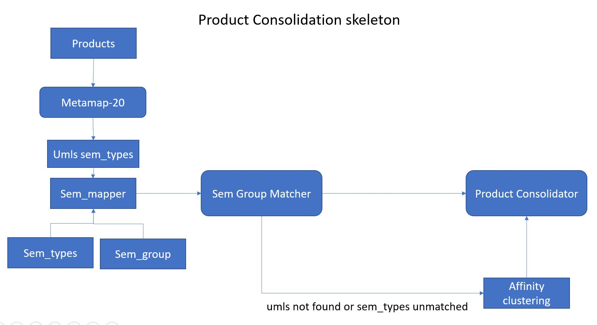

```
# Input Data : XML extracts from solr 
# Preprocessing steps:
  1. XML to Dataframe conversion --> xml_df_parser
  fields : 	
```  
| id  | product_name | publication_count  | pubmed_id |company_name | file_name | source  | category |product_id 
|--- | ------------- | ------------- | ------------- |--- | ------------- | ------------- | ------------- | ------------|
| 6ab0f7cb-7e29-4e0f-82db-20a121bf8354 | rAd5-CMV-PLAP-aMh-ILZ-HA|	1 |	26962869 | Sigma-Aldrich | products_processed_4.xml| product_extraction_pipeline|
| 1aac1cc7-30fd-42f0-8026-20a259e98daf | transthoracic | 1 | 28793044 | General Electric Company| products_processed_5.xml | product_extraction_pipeline|
```
2. Product csv -->(product name)-->metamap annotator
3. Metamap annotated  

```
| pmid | matched_candidate | preferred_candidate | candidate_score | stype| sem_type |
|---|---|---|---|---|---|
|26962869| PLAP | PLAA gene | -632 | -- |  gngm |
|26962869| AMH | AMH gene | -632 | -- | gngm |
|26962869| HA | Haiti | -799 | -- | geoa |
|28793044| Transthoracic| Transthoracic approach| -1000 |--| spco|

4. Group and merge to orginal dataframe on pmid in left
```path : .\product_extraction_KebioLM_v02\product_consolidation\review_data\v2_old\sample500

   1. company_name : Sigma-Aldrich
   2. product name : Ad5-CMV-PLAP-aMh-ILZ-HA
   3. match candidate : ['PLAP', 'AMH', 'HA']
   4. preferred_candidate : ['PLAA gene', 'AMH gene', 'Haiti'] 
   5. candidate_score: [-632, -632, -799] 
   6. sem_type: ['gngm', 'gngm', 'geoa']
   7. company_name: General Electric Company
   8. product name : transthoracic 
   9. match candidate: ['Transthoracic']
   10. preferred_cnadidate: ['Transthoracic approach']
   11. candidate score: [-1000]
   12. sem_type: ['spco']
```
5. Get sem_types and sem_groups text files from Metamap website and store in preprocess folder
```
https://lhncbc.nlm.nih.gov/ii/tools/MetaMap/documentation/SemanticTypesAndGroups.html
```
6. group semtypes and semgroups using sem_abbre:

```
path ..\product_consolidation\preprocessed_data\
file: sem_relation
```

| sem_groups | sem_abbre | index | sem_type | sem_abbrev |
|---|---|---|---|---|
|Concepts & Ideas | CONC | ['T078', 'T082', 'T171', 'T080', 'T079', 'T081', 'T169', 'T185', 'T089', 'T102', 'T077', 'T170']|	['Spatial Concept', 'Temporal Concept', 'Intellectual Product', 'Functional Concept', 'Language', 'Quantitative Concept', 'Qualitative Concept', 'Conceptual Entity', 'Group Attribute', 'Regulation or Law', 'Classification', 'Idea or Concept']|	['inpr', 'grpa', 'ftcn', 'clas', 'idcn', 'rnlw', 'spco', 'lang', 'tmco', 'qlco', 'cnce', 'qnco']|

7. Match prefered candidate list in sem_abbrev list 
```
path:product_consolidation\review_data\v2_old\sample5k
file:prod_sem_group_matched
 
```
   1. sem_type: ['spco'] --> concepts and ideas 
   2. assign group to PMID 

| id   | product_name | publication_count | pubmed_id |company_name | matched_candidate | preferred_candidate | candidate_score | sem_type | Length | sem_group | 
| ----------- | ----------- | ----------- | ----------- | ----------- | ----------- | ----------- | ----------- | ----------- | ----------- | ----------- |
| 1aac1cc7-30fd-42f0-8026-20a259e98daf|transthoracic | 1 | 28793044 | General Electric Company| ['Transthoracic']|['Transthoracic approach'] | [-1000] | spco | 1 | CONC |

4. Merge Semantic groups in original Dataframe


```

file: metamap20_sample_consolidated

```
#### Steps for Execution
### Environment creation and Setup 

#### Hanaserver 
```
conda create --prefix=/mnt4/aims/products/prod_consolidation/X232747_vikas python=3.9

conda activate /work2/skumar20/Product_cluster/X232747_vikas 
cd  /work2/skumar20/Product_cluster/product_consolidation/ 
python metamap_sem_prod_consolidator.py
```

#### Bigmarketing 
```

source /work/textmining/news/competitors/EDGE/anaconda3/bin/activate
conda activate condaaims

## previous process testing
cd /mnt4/aims/products/prod_consolidation/X232747_vikas/prod_consolidator)
python metamap_sem_prod_consolidator.py

## updated process testing
cd /mnt4/aims/products/prod_consolidation/X232747_vikas/product_consolidation_big
python metamap_sem_prod_consolidator.py
```

#### output
Dataframe to Solr format Xml--> output_xml


