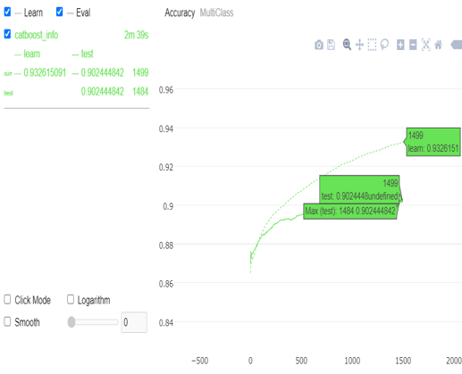

# Projects
### Here some small usecases and small skeleton of ML Projects with working prototypes and

## Building Permit Classification
Building Permit is task to classify Building type to accommodation of various sector.

Type of Building Permit 
SINGLE FAMILY / DUPLEX
COMMERCIAL
INSTITUTIONAL
MULTIFAMILY
INDUSTRIAL

Feature engineering

# KMeans for Clustering Geospatial Locations
Missing values

Categorical Distribution

Kmeans Clustering

DateTime Conversion 
./ML_usecases/Building_Permit_Classification/

Model Training 
As we have Text features so we use TFIDF with 20 features and 50 features 
and use catboost model for classification and shap to get insights

Finally Deep learning 

Evaluation metrics

## Loan Top Up Prediction(Hackathon)

LTFS Top-up loan Up-sell prediction
A loan is when you receive the money from a financial institution in exchange for future repayment of the principal, plus interest. Financial institutions provide loans to the industries, corporates and individuals. The interest received on these loans is one among the main sources of income for the financial institutions.

A top-up loan, true to its name, is a facility of availing further funds on an existing loan. When you have a loan that has already been disbursed and under repayment and if you need more funds then, you can simply avail additional funding on the same loan thereby minimizing time, effort and cost related to applying again.

LTFS provides it’s loan services to its customers and is interested in selling more of its Top-up loan services to its existing customers so they have decided to identify when to pitch a Top-up during the original loan tenure.  If they correctly identify the most suitable time to offer a top-up, this will ultimately lead to more disbursals and can also help them beat competing offerings from other institutions.

To understand this behaviour, LTFS has provided data for its customers containing the information whether that particular customer took the Top-up service and when he took such Top-up service, represented by the target variable Top-up Month.
You are provided with two types of information: 

1. Customer’s Demographics: The demography table along with the target variable & demographic information contains variables related to Frequency of the loan, Tenure of the loan, Disbursal Amount for a loan & LTV.

2. Bureau data:  Bureau data contains the behavioural and transactional attributes of the customers like current balance, Loan Amount, Overdue etc. for various tradelines of a given customer

As a data scientist, LTFS  has tasked you with building a model given the Top-up loan bucket of 128655 customers along with demographic and bureau data, predict the right bucket/period for 14745 customers in the test data.

## NLP usecases
Here is alot usecases developed and under development I will discuss few in skeleton, roadmap and Issues rest you can refer repo under NLP usecases
Links for repo 

## Biomedical Keyphrase Extractions(Refer repo BioNLP)
https://github.com/Vikas1667/BioNLP

 1. Scispacy
 2. Fasttext
 3. Sentence Transformers
 4. Maximal Marginal Retrieval
 5. D3 plot(Kmapper)
  
## Text Classification for Binary, Multiclass and Multi label using Deep learning  
 1. CNN 
 2. LSTM
 3. Kfold 
 4. Tfidf 
 
## NER using Deep learning and BERT for Few Shot Learning and Zero shot learning
  1. Scispacy
  2. Scibert and KeBioLM
  3. Affinity Propogation clustering
  
## Sentiment Analysis (Inprogress) using CNN, LSTM and Transformers for Financial Data 
   1. Finbert(Under development)   
   2. BSNL and Keyword search Twitter Sentiment analysis(Under development)

## Indent and Emotion classification(To start)

## Language Translation (In progress)

## Biomedical Term search Engine
1. Fiass 
2, Sentence Embedding

## Text Mining and NLP   
1. News Extraction and NLP(UK and Spainish news) 
2. Check another repo: stockNLP 

## Biomedical Article Extraction(check BioNLP repo)
1. Pubmed Extraction Skeleton 
2. Streamlit Dashboard for Term search  
3. Patent Article Extraction

## Lung Cancer Detection Using Fuzzy logic and CNN 
Lung cancer (both small cell and non-small cell) is the second most common cancer in both men and women (not counting skin cancer). In men, prostate cancer is more common, while in women breast cancer is more common. About 14% of all new cancers are lung cancers.
The American Cancer Society’s estimates for lung cancer in the United States for 2018 are:
About 234,030 new cases of lung cancer (121,680 in men and 112,350 in women)
About 154,050 deaths from lung cancer (83,550 in men and 70,500 in women)
CT scan images is been used for processing.In preprocessing, segementation is important step to reduce computational time as well as space.In segmentation, lungs to be extracted from alonside parts like ribs,air,etc which can be precisely because if it is not done there is chances of loosing important data.   

## Consumer Narratives classification
The dataset comprises of Consumer Complaints on Financial products and we'll see how to classify consumer complaints text into these categories: Debt collection, Consumer Loan, Mortgage, Credit card, Credit reporting, Student loan, Bank account or service, Payday loan, Money transfers, Other financial service, Prepaid card.

The classification task would help banking/financial institution to quickly identify and provide customized solutions to each customer based on complaints received departmentwise. 
The dataset is available in link:- https://www.kaggle.com/cfpb/us-consumer-finance-complaints

## Insurance claim Prediction
## Loan Prediction

## Text Classification 
AG's News Topic Classification Dataset
Version 3, Updated 09/09/2015
ORIGIN
AG is a collection of more than 1 million news articles.News articles have been gathered from more than 2000 news sources by ComeToMyHead in more than 1 year of activity. ComeToMyHead is an academic news search engine which has been running since July, 2004. The dataset is provided by the academic comunity for research purposes in data mining (clustering, classification, etc), information retrieval (ranking, search, etc), xml, data compression, data streaming, and any other non-commercial activity. For more information, please refer to the link http://www.di.unipi.it/~gulli/AG_corpus_of_news_articles.html . The AG's news topic classification dataset is constructed by Xiang Zhang (xiang.zhang@nyu.edu) from the dataset above. It is used as a text classification benchmark in the following paper: Xiang Zhang, Junbo Zhao, Yann LeCun. Character-level Convolutional Networks for Text Classification. Advances in Neural Information Processing Systems 28 (NIPS 2015).

#### DESCRIPTION
The AG's news topic classification dataset is constructed by choosing 4 largest classes from the original corpus. Each class contains 30,000 training samples and 1,900 testing samples. The total number of training samples is 120,000 and testing 7,600.

The file classes.txt contains a list of classes corresponding to each label. The files train.csv and test.csv contain all the training samples as comma-sparated values. There are 3 columns in them, corresponding to class index (1 to 4), title and description. The title and description are escaped using double quotes ("), and any internal double quote is escaped by 2 double quotes (""). New lines are escaped by a backslash followed with an "n" character, that is "\n".

## Image classification and Segmentation
Bacterial strips often required to segment before feeding deep learning models for computation, so accurate segmentation is vital part is evaluated 
selfie image is been required to identify from various sources and its trained using CNN.

#### Description 
How to Take a Good Selfie?
Mahdi M. Kalayeh, Misrak Seifu, Wesna LaLanne, Mubarak Shah
mahdi@eecs.ucf.edu, misrak.seifu@gmail.com, wlalanne@knights.ucf.edu, shah@crcv.ucf.edu
Oxford Dictionary: Selfie is a photograph that one has taken of
oneself, typically one taken with a smartphone or webcam and shared
via social media.
How Big is the Selfie Phenomenon? Google recently reported
that there are about 93 millions of selfies taken every day only on
Android devices!
Research Questions:
1. How do different attributes, such as gender, race or hair color,
influence the popularity of selfies?
2. How does the appearance of certain objects or particular
concepts affect the popularity of selfies?
3. Is there a relationship between the sentiment inferred from a
selfie and its popularity?
4. How does post-processing, such as applying different Instagram
filters, influence the popularity of selfies?

## Drone Path for Getting aerial images for Survelience

Drone for Aerial Intelligence is widely used recently for various applications

#### Description
We have a video that we've shot over their site, as well as a set of aerial images. We would like to show them a POC level
app where they can watch the video, and whenever they pause the video to inspect
anything, we will be able to show them the images taken at that point. It will 
add great value to our entire offering.

